# Space tourism multipage website - Frontend Mentor

This is a solution to the [Space tourism website challenge on Frontend Mentor](https://www.frontendmentor.io/challenges/space-tourism-multipage-website-gRWj1URZ3) that consists on building a **landing page** that looks as close to the given design as possible. The goal is to improve my web layout skills by building a realistic project.

## 1. Table of contents

- [Space tourism multipage website - Frontend Mentor](#space-tourism-multipage-website---frontend-mentor)

  - [1. Table of contents](#1-table-of-contents-️)
  - [2. Overview](#2-overview-)
    - [The challenge](#the-challenge)
    - [Screenshots](#screenshots)
    - [Links](#links)
  - [3. My process](#3-my-process-)
    - [Built with](#built-with)
    - [What I learned](#what-i-learned)
    - [Continued development](#continued-development)
    - [Useful resources](#useful-resources)

## 2. Overview

### The challenge

Users should be able to:

- View the optimal layout for each of the website's pages depending on their device's screen size
- See hover states for all interactive elements on the page
- View each page and be able to toggle between the tabs to see new information

You can checkout the challenge details in the [Frontend Mentor page](https://www.frontendmentor.io/challenges/space-tourism-multipage-website-gRWj1URZ3).

### Screenshots

**_Desktop Layout_** (1440 X 900)\
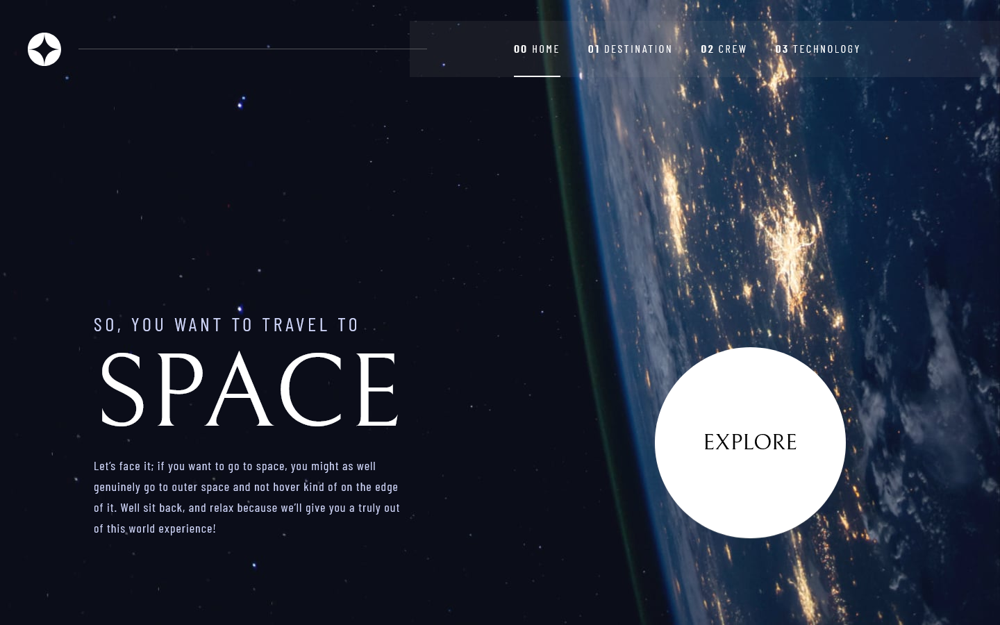
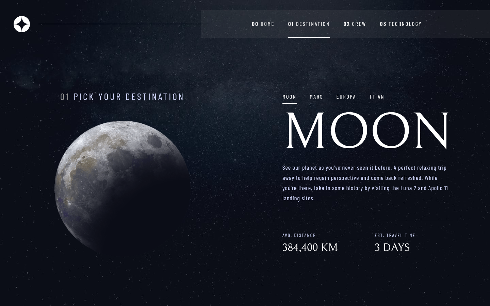
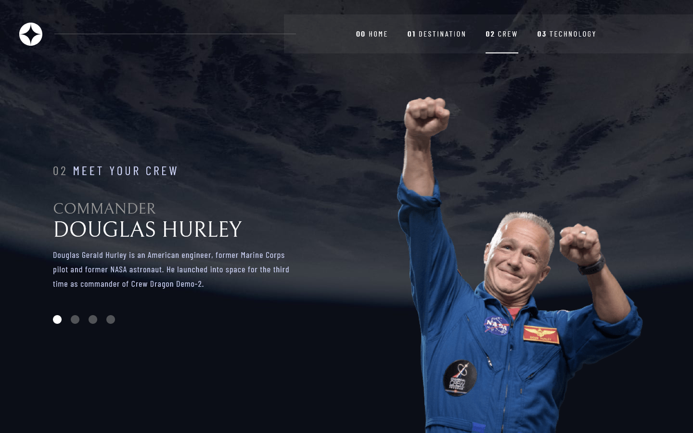
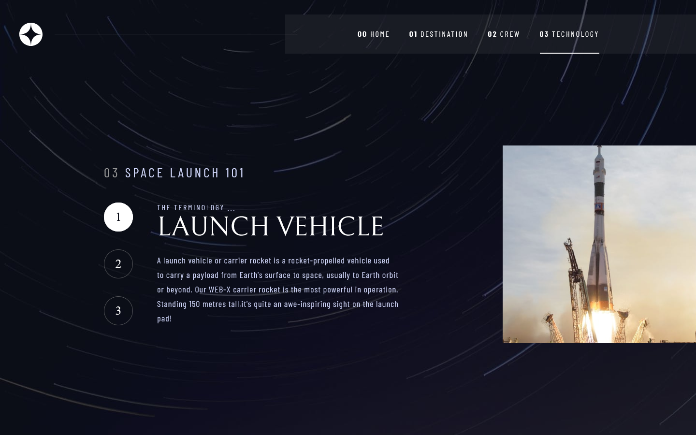

**_Tablet Layout_** (768 x 1024)\
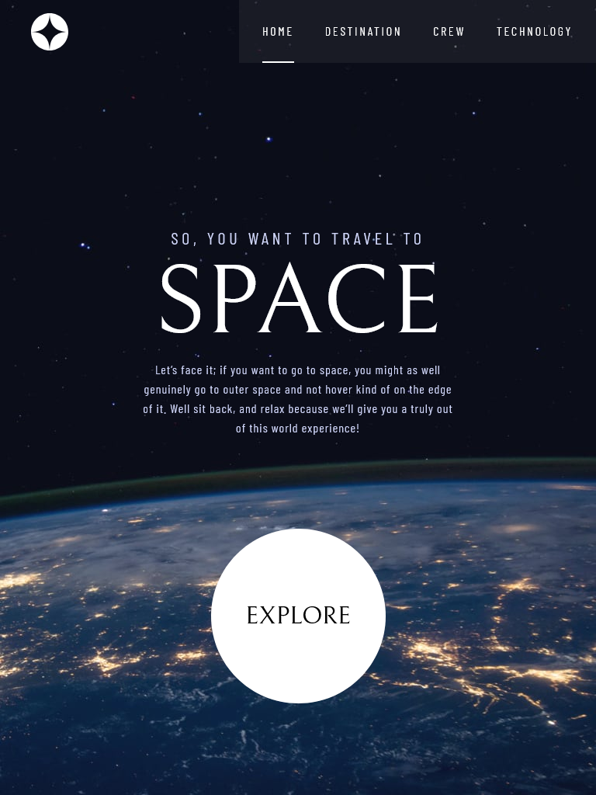
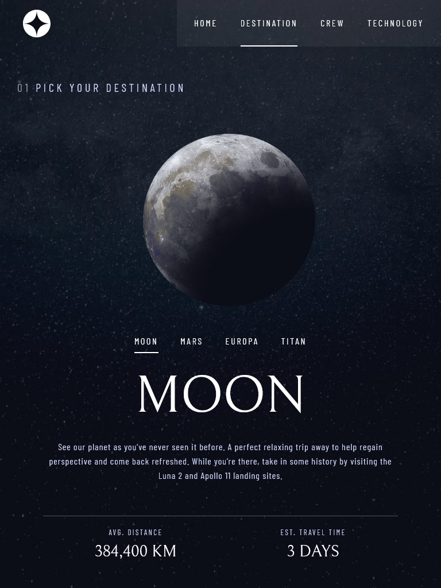
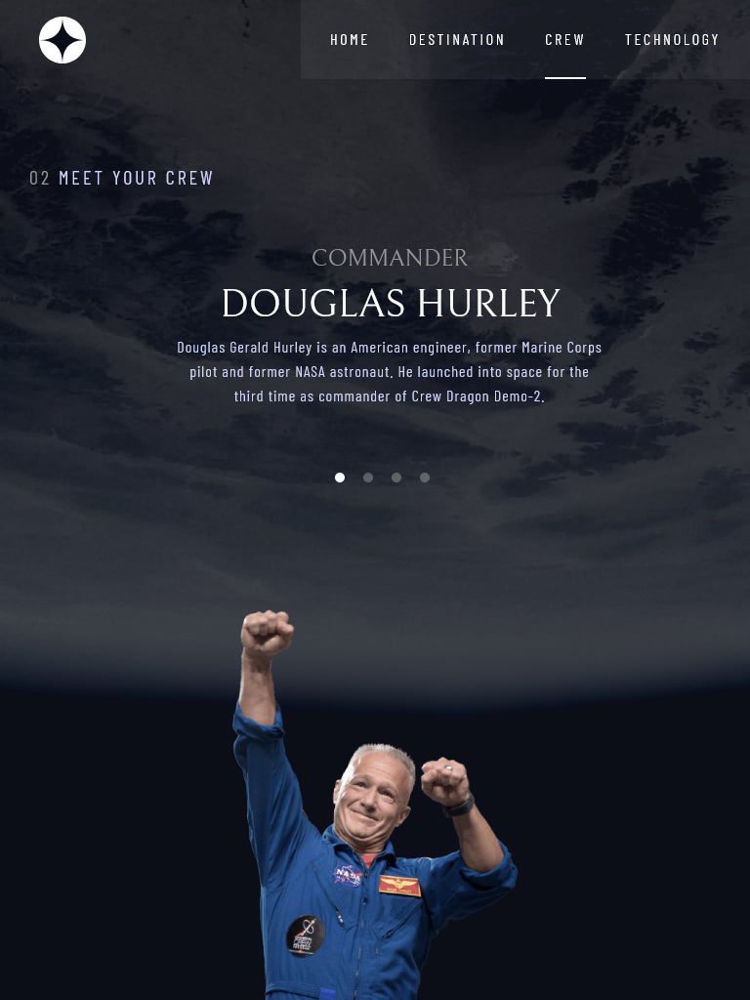
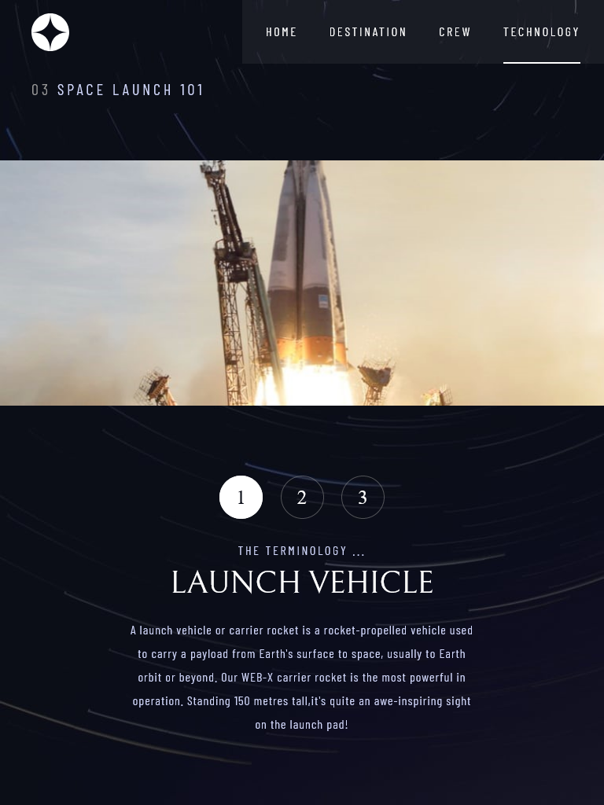

**_Mobile Layout_** (375 x 667) \
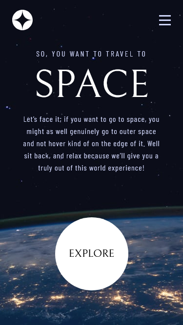
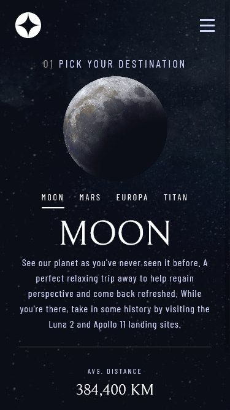
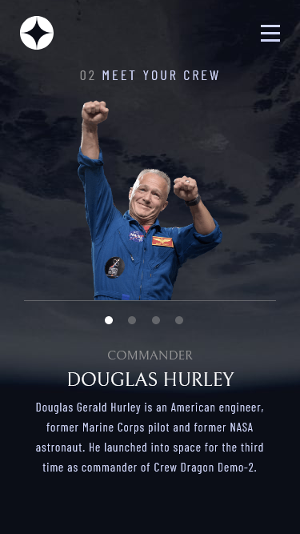
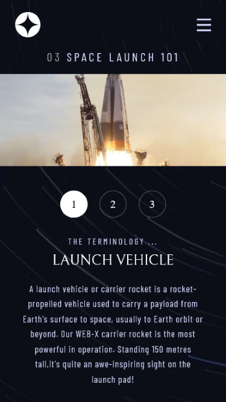

### Links

- Solution URL: [Github Respository](https://your-solution-url.com)
- Live Site URL: [Hosted on Github Pages](https://your-live-site-url.com)

## 3. My process

### Built with

- Semantic **HTML5** markup
- HTML **templating system**
- **CSS3** custom properties
- **Flexbox**
- **CSS Grid**
- **SASS** with **BEM** methodology
- Vanilla **JS**

### What I learned

- Responsive UI/UX development
- Using the chrome inspector to emulate different screen sizes
- Using CSS grid to create responsive and dynamic layouts
- CSS media queries
- Using javascript to allow single page functionality

### Continued development

- Use **ARIA roles** to improve **web accessibilty**: for example, take a look at these navigation menu roles.

```html
<nav class="header-menu" role="navigation">
  <ul class="header-menu__list" role="list">
    <li class="header-menu__list-item" role="list-item">
      <a class="header-menu__link" href="#" role="link">
        Features
      <a>
    </li>
    ...
  </ul>
</nav>
```

### Useful resources

- [MDN](https://developer.mozilla.org/en-US/docs/Web/JavaScript) - This helped me by acting as a reference for the built in js API

- [MDN](https://developer.mozilla.org/en-US/docs/Web/Accessibility/ARIA/Roles) - List of ARIA roles, states and properties

